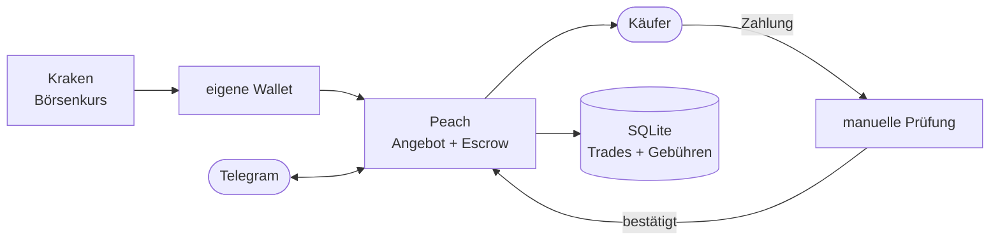

# Bitcoin Arbitrage Bot

Kauft Bitcoin auf einer Börse (Kraken) zum Börsenkurs und verkauft sie auf einem
Peer-to-Peer-Marktplatz (Peach) mit Aufpreis an Privatpersonen. Angebote, Escrow
und Preisanpassung laufen automatisch, die Zahlungsprüfung bleibt manuell.
Gesteuert per Telegram, dazu ein kleines Web-Dashboard.


## Die Idee in einfachen Worten

Auf P2P-Marktplätzen kaufen Leute Bitcoin direkt von anderen Personen, ohne
Konto bei einer Börse. Dafür zahlen sie einen Aufpreis gegenüber dem Börsenkurs,
typischerweise ein paar Prozent. Der Bot nutzt diese Differenz.

Der Gewinn ist der Aufpreis abzüglich Gebühren – Börse, Auszahlung,
Blockchain-Transaktion und Plattform.

## Was der Bot macht

1. **Kaufen** – Marktorder auf Kraken, Auszahlung der BTC in eine eigene Wallet.
2. **Anbieten** – Verkaufsangebot auf Peach mit Aufpreis (die Plattform erlaubt
   aktuell höchstens +6 %).
3. **Absichern** – die BTC gehen in ein Escrow, ein Treuhandkonto auf der
   Blockchain, damit der Käufer sicher sein kann, dass die Coins da sind.
4. **Nachsteuern** – findet ein Angebot nach 24 Stunden keinen Käufer, senkt der
   Bot den Aufpreis schrittweise. Die Höhe leitet er aus den Angeboten der
   Konkurrenz ab.
5. **Freigeben** – meldet ein Käufer die Zahlung, schickt der Bot eine
   Telegram-Nachricht mit Betrag und Konto. Bestätigt wird von Hand, dann gehen
   die BTC aus dem Escrow an den Käufer.

Jeder Trade wird mit allen Gebühren in einer SQLite-Datenbank erfasst.

## Beispiel

```
/status

Status ▶️ (3d 4h)
Spot: 84'200 CHF

Plattformen
  peach: ok

Exchanges
  kraken: ok

Offers: 2 pending, 1 funded
Heute: 1'250'000 sats
```

*(Beispiel mit erfundenen Zahlen.)*

## Architektur



Mehr Details — Trade-Lebenszyklus, Sicherheitsmodell, Komponenten:
[docs/architecture.md](docs/architecture.md)

Zusätzlich gibt es eine
[interaktive Version des Diagramms](https://claudiokoller.github.io/bitcoin-arbitrage-bot/architecture-diagram.html).

## Technisch interessante Teile

- **Bitcoin-Signaturen selbst implementiert** ([core/taproot.py](core/taproot.py)):
  Die Plattform nutzt Taproot-Escrows. Adressberechnung und Schnorr-Signaturen
  habe ich nach den Spezifikationen BIP340/341 in Python umgesetzt.
- **Schlüssel aus einer Seed-Phrase** ([core/hd_keys.py](core/hd_keys.py)): Jedes
  Angebot bekommt einen eigenen Escrow-Schlüssel, abgeleitet nach BIP32/39 –
  gleich wie in der offiziellen App, damit beide dieselben Schlüssel sehen.
- **Nichts blind signieren**: Vor dem Finanzieren rechnet der Bot die
  Escrow-Adresse selbst nach, vor der Freigabe prüft er, dass sie an den Käufer
  geht. Bei einem Single-Sig-Escrow reicht eine Signatur, um die Coins zu
  bewegen – ein Fehler wäre nicht rückgängig zu machen.
- **Angebotsgrösse in Franken** ([core/offer_sizing.py](core/offer_sizing.py)):
  Die Plattform begrenzt ein Angebot auf einen CHF-Betrag; der Bot rechnet die
  Grenze jeden Durchlauf neu in Satoshi um.
- **Mehrere Threads**: Hauptschleife und Telegram-Bot laufen parallel auf
  denselben Daten; Locks verhindern, dass sie sich in die Quere kommen.
- **Verschlüsselte Zahlungsdaten**: Bankdaten gehen nur PGP-verschlüsselt an den
  Käufer.

## Module

```
├── core/
│   ├── engine.py          # Hauptschleife (alle ~30 s)
│   ├── models.py          # Datenmodelle (Angebot, Vertrag …)
│   ├── hd_keys.py         # Schlüsselableitung aus der Seed-Phrase (BIP32/39)
│   ├── taproot.py         # Taproot-Adressen und Schnorr-Signaturen (BIP340/341)
│   ├── offer_sizing.py    # Angebotsgrössen aus dem CHF-Limit
│   ├── pricing.py         # Aufpreis-Berechnung aus den Konkurrenzangeboten
│   └── trade_logger.py    # Trade-Datenbank (SQLite)
├── exchanges/             # Kraken, Bitvavo
├── platforms/             # Peach
├── notifications/         # Telegram-Befehle und Meldungen
├── dashboard.py           # Web-Dashboard (Flask)
└── run.py                 # Startpunkt
```

## Setup

```bash
pip install requests python-telegram-bot coincurve pgpy flask

cp config.example.json config.json
# config.json mit API-Keys, Seed-Phrase und Zahlungsdaten ausfüllen

python run.py
```

Braucht Python 3.11+, ein Kraken-Konto, ein Peach-Konto und einen Telegram-Bot
(via [@BotFather](https://t.me/BotFather)). Seed-Phrase und Zahlungsdaten
gehören in die lokale `config.json` und nie ins Repo.

## Designentscheide

- **Die Zahlungsprüfung bleibt beim Menschen.** Ob Geld eingegangen ist, sieht
  nur die Bank. Der teuerste Fehler wäre, Bitcoin für eine Zahlung freizugeben,
  die nie ankam – das zu automatisieren spart wenig Zeit und schafft viel Risiko.
- **Selbst nachrechnen statt vertrauen.** Escrow-Adresse und Auszahlungsziel
  prüft der Bot aus den eigenen Schlüsseln, bevor er signiert.
- **Alles mit Gebühren rechnen.** Erst nach Abzug von Börsen-, Auszahlungs-,
  Blockchain- und Plattformgebühr zeigt sich, ob ein Trade sich gelohnt hat.

## Hinweis zum Umfang

Der Bot läuft produktiv. Dieses Repo zeigt den Code als Portfolio-Projekt, nicht
als fertige Lösung zum Nachbauen.

**Veröffentlicht:** Taproot-Implementierung, Schlüsselableitung, Angebotsgrössen,
Preisberechnung, Anbindung an Kraken und Peach, Datenmodell, Datenbank,
Telegram-Bot und Dashboard.

**Nicht veröffentlicht:** die eigentliche Handelslogik, das Bauen der
Wallet-Transaktionen und der Umgang mit Zahlungsdaten. In
[core/engine.py](core/engine.py) stehen diese Funktionen als dokumentierte
Hüllen, damit der Ablauf nachvollziehbar bleibt.

Nutzung auf eigenes Risiko.

## Lizenz

MIT – siehe [LICENSE](LICENSE).
