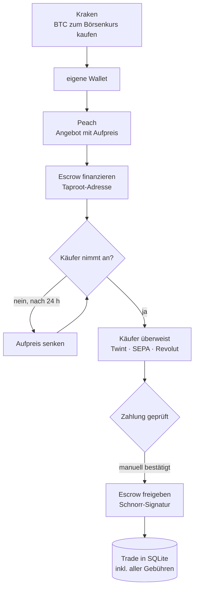

# Architektur

`run.py` startet drei Teile im selben Prozess: die Hauptschleife, den
Telegram-Bot und das Web-Dashboard. Die Schleife arbeitet alle ~30 Sekunden
einen Durchlauf ab, der Telegram-Bot reagiert dazwischen auf Befehle. Beide
greifen auf dieselben Daten zu, Locks verhindern Kollisionen. Der Zustand liegt
in einer SQLite-Datei.

## Ablauf eines Trades

## Komponenten

| Verzeichnis | Aufgabe |
|---|---|
| `core/` | Hauptschleife, Datenmodelle, Schlüsselableitung, Taproot, Preislogik, Trade-Datenbank |
| `exchanges/` | Anbindung an Kraken (und Bitvavo als Alternative) |
| `platforms/` | Anbindung an den P2P-Marktplatz Peach |
| `notifications/` | Telegram-Befehle und Meldungen |
| `dashboard.py` | Web-Dashboard (Flask): Gewinn über Zeit, Trade-Historie |

## Sicherheitsmodell

Der Escrow ist Single-Sig: eine Signatur allein bewegt die Coins. Eine falsche
Signatur wäre nicht rückgängig zu machen. Deshalb prüft der Bot vor jedem
Schritt selbst nach, statt der Gegenseite zu vertrauen:

- **Vor dem Finanzieren** rechnet er die Escrow-Adresse aus den eigenen
  Schlüsseln nach und vergleicht sie mit der, die die Plattform nennt.
- **Vor dem Freigeben** prüft er, dass die Auszahlung tatsächlich an den Käufer
  geht und nicht an eine fremde Adresse.
- **Die Schlüssel** werden pro Angebot aus einer Seed-Phrase abgeleitet
  (BIP32/39) – gleich wie in der offiziellen App, damit beide Seiten dieselben
  Schlüssel sehen.

## Was bewusst manuell bleibt

Ob Geld auf dem Konto eingegangen ist, sieht nur die Bank. Meldet ein Käufer
eine Zahlung, schickt der Bot eine Telegram-Nachricht mit Betrag und Konto –
die Freigabe bestätigt ein Mensch. Die automatische Bestätigung ist
standardmässig ausgeschaltet.

Das ist die wichtigste Entscheidung im Projekt: Der teuerste Fehler wäre,
Bitcoin für eine Zahlung freizugeben, die nie ankam. Diesen Schritt zu
automatisieren würde wenig Zeit sparen und viel Risiko schaffen.

## Warum es so gebaut ist

**Grössen in Franken statt in Satoshi.** Die Plattform begrenzt ein Angebot auf
einen CHF-Betrag. Da der Kurs schwankt, rechnet der Bot die Grenze in jedem
Durchlauf neu um, statt mit festen Satoshi-Werten zu arbeiten, die bald
veraltet wären.

**Aufpreis aus dem Markt statt fix.** Der Bot vergleicht die Aufpreise der
Konkurrenz und schlägt einen eigenen vor. Findet ein Angebot nach 24 Stunden
keinen Käufer, senkt er ihn schrittweise.

**Alles mit Gebühren rechnen.** Jeder Trade wird mit Börsen-, Auszahlungs-,
Blockchain- und Plattformgebühr erfasst. Der Bruttoaufpreis sagt wenig – erst
nach Abzug aller vier zeigt sich, ob ein Trade sich gelohnt hat.

## Erweitern

- **Neue Börse:** Modul in `exchanges/` ergänzen, das Kurs, Kauf und Auszahlung
  bereitstellt.
- **Neuer Marktplatz:** Modul in `platforms/` ergänzen – die Escrow-Logik in
  `core/` bleibt gleich, solange der Marktplatz Taproot nutzt.
